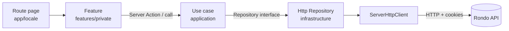

# Rondo Web

Frontend for the **Rondo** project, a service to create, share and collaborate on football plays.

The web app lets users sign up, publish plays (_posts_), save them as _drafts_, comment, propose changes to other users' plays (_proposals_) and mark content as favourite. It consumes the [Rondo API](#api-integration) and is fully internationalized (English and Spanish).

## Table of contents

- [Tech stack](#tech-stack)
- [Prerequisites](#prerequisites)
- [Getting started](#getting-started)
  - [Environment variables](#environment-variables)
  - [Running locally](#running-locally)
- [Internationalization](#internationalization)
- [Authentication](#authentication)
- [API integration](#api-integration)
- [Architecture](#architecture)
  - [Vertical Slicing](#vertical-slicing-organization-by-features)
  - [Hexagonal Architecture](#hexagonal-architecture-organization-by-layers)
  - [Route groups](#route-groups)
  - [Data flow](#data-flow)
  - [Dependency injection](#dependency-injection)
- [Project structure](#project-structure)

## Tech stack

| Area                 | Technology                                                                                      |
| -------------------- | ----------------------------------------------------------------------------------------------- |
| Framework            | [Next.js](https://nextjs.org/) 16 (App Router, React Server Components)                         |
| UI library           | [React](https://react.dev/) 19                                                                  |
| Language             | [TypeScript](https://www.typescriptlang.org/)                                                   |
| Styling              | [CSS Modules](https://github.com/css-modules/css-modules)                                       |
| Internationalization | [next-intl](https://next-intl.dev/)                                                             |
| Dependency injection | [InversifyJS](https://inversify.io/)                                                            |
| Schema validation    | [Zod](https://zod.dev/)                                                                         |
| Authentication       | JWT via cookies ([jwt-decode](https://github.com/auth0/jwt-decode))                             |
| Utilities            | [use-debounce](https://github.com/xnimorz/use-debounce), [uuid](https://github.com/uuidjs/uuid) |
| Linting              | [ESLint](https://eslint.org/) (`eslint-config-next`)                                            |

## Prerequisites

- **Node.js 20+**.
- A running instance of the **Rondo API** (see [API integration](#api-integration)).

## Getting started

### Environment variables

Configuration is fed by environment variables. Create a `.env.local` file at the project root:

| Variable  | Description                       | Default value    |
| --------- | --------------------------------- | ---------------- |
| `API_URL` | Base URL of the Rondo API backend | `localhost:3000` |

Example `.env.local`:

```env
API_URL=http://localhost:3000
```

> The HTTP client reads `API_URL` in [src/api/http/client/ServerHttpClient.ts](src/api/http/client/ServerHttpClient.ts). All requests are issued server-side and forward the authentication cookies to the backend.

### Running locally

```bash
# 1. Install dependencies
npm install

# 2. Start the dev server (hot reload)
npm run dev
```

The app will be available at `http://localhost:3000`.

Other useful scripts:

```bash
# Production build
npm run build

# Start the production server (after build)
npm run start

# Lint
npm run lint
```

## Internationalization

The app uses **next-intl** with a locale segment in the URL (`/[locale]/...`). Supported locales are defined in [src/i18n/routing.ts](src/i18n/routing.ts):

- `en` — English (default)
- `es` — Spanish

Translations live in [src/messages/en.json](src/messages/en.json) and [src/messages/es.json](src/messages/es.json). Locale detection and routing are handled by the `intlMiddleware` (see [Authentication](#authentication)).

## Authentication

Authentication is handled through JWT cookies (`accessToken` / `refreshToken`) set by the backend. Route protection and session refresh happen in Next.js middleware.

Middlewares are composed with a small chain runner ([src/middlewares/chain.ts](src/middlewares/chain.ts)) in [src/middleware.ts](src/middleware.ts):

```ts
export default chain([intlMiddleware, authMiddleware]);
```

- **`intlMiddleware`** — resolves the active locale and rewrites the request.
- **`authMiddleware`** — guards private routes, redirects unauthenticated users to `/login`, keeps authenticated users out of the public auth pages and triggers a token refresh when needed.

Public routes: `/login`, `/register`. Private routes are enumerated in [src/types/AppSectionsRoutes.ts](src/types/AppSectionsRoutes.ts) (`home`, `create`, `post`, `community`, `my-tactics`, `proposal`, `edit`).

## API integration

The frontend does not talk to MongoDB directly, it consumes the **Rondo API** over HTTP. The `ServerHttpClient` ([src/api/http/client/ServerHttpClient.ts](src/api/http/client/ServerHttpClient.ts)) centralizes request building, query-param cleanup, cookie forwarding and token-refresh handling. Repository implementations in each module's `infrastructure/` layer use this client to reach the backend.

## Architecture

The project combines two complementary ideas: **Vertical Slicing** (how the domain logic is organized) and **Hexagonal Architecture** (how each slice is organized internally), while following the Next.js **App Router** conventions for routing and UI.

### Vertical Slicing (organization by _features_)

Domain logic under [src/modules/](src/modules) is grouped by **business feature**, not by technical type. Each folder is a self-contained vertical slice:

```
src/modules/
├── auth/       → login, register and session refresh
├── user/       → user profile and account management
├── post/       → published plays, comments and likes
├── draft/      → play drafts
├── proposal/   → proposed changes to plays
└── shared/     → reusable cross-cutting code (services, pagination, DI tokens)
```

Each slice contains everything it needs (domain, application logic and infrastructure), which reduces coupling between features.

### Hexagonal Architecture (organization by layers)

Within each _slice_, the code is split into three layers. The dependency rule is strict: **outer layers depend on inner layers, never the other way around**.

```
┌─────────────────────────────────────────────┐
│  infrastructure/  (adapters: HTTP repos)     │
│  ┌─────────────────────────────────────────┐ │
│  │  application/  (use cases)              │ │
│  │  ┌───────────────────────────────────┐  │ │
│  │  │  domain/  (models, ports, VOs)    │  │ │
│  │  └───────────────────────────────────┘  │ │
│  └─────────────────────────────────────────┘ │
└─────────────────────────────────────────────┘
```

- **`domain/`** — The core. Contains models, _value objects_ and the **repository interfaces** (the _ports_). It does not depend on any framework.

- **`application/`** — Orchestrates the domain through **use cases** (e.g. [CreatePost.ts](src/modules/post/application/use-cases/CreatePost.ts)). Each use case resolves a concrete action, receives its dependencies via the constructor and works against the domain interfaces.

- **`infrastructure/`** — The **adapters**. Implements the domain interfaces against the backend API (e.g. `HttpPostRepository`) and holds DTOs and mappers that translate between the API payloads and the domain models.

### Route groups

The App Router lives under [src/app/[locale]/](src/app/[locale]) and uses **route groups** to separate authenticated and unauthenticated areas:

- **`(private)/`** — protected sections (`home`, `create`, `post`, `community`, `my-tactics`, `proposal`, `edit`), wrapped by a shared layout.
- **`(public)/`** — the `(auth)` pages (login / register).

The route pages stay thin: the actual UI and behaviour of each section lives in [src/features/](src/features), split into `private/` and `public/`. Reusable presentational pieces live in [src/components/](src/components) as self-contained folders (`Component.tsx` + `Component.module.css` + `index.ts`).

### Data flow



1. A route page renders a **feature** component from `src/features/`.
2. The feature invokes a **use case** (often through a server action), passing already-validated data (Zod).
3. The use case operates on the domain and delegates persistence/fetching to a **repository interface**.
4. The HTTP repository uses `ServerHttpClient` to reach the backend, forwarding the auth cookies.

### Dependency injection

Each feature wires its own pieces together with **InversifyJS** in a module file (e.g. [src/modules/post/PostModule.ts](src/modules/post/PostModule.ts)). There, repositories and use cases are registered and bound to _tokens_ defined in [src/modules/shared/domain/Token.ts](src/modules/shared/domain/Token.ts), then resolved and exported as ready-to-use singletons.

## Project structure

```
rondo-web/
├── eslint.config.mjs            # ESLint configuration
├── next.config.ts               # Next.js + next-intl configuration
├── tsconfig.json                # TypeScript configuration (@/* → src/*)
├── public/                      # Static assets
└── src/
    ├── middleware.ts            # Middleware chain (intl + auth)
    ├── api/http/client/         # ServerHttpClient (backend HTTP client)
    ├── app/[locale]/            # App Router: (private) & (public) route groups
    ├── features/                # Section-level UI (private / public)
    ├── components/              # Reusable presentational components
    ├── modules/                 # Domain logic per feature (hexagonal slices)
    │   └── <feature>/           # auth, user, post, draft, proposal, shared
    │       ├── application/      # Use cases and DTOs
    │       ├── domain/           # Models, value objects, repos (ports)
    │       └── infrastructure/   # HTTP repositories, DTOs and mappers
    ├── middlewares/             # intl, auth and chain runner
    ├── i18n/                    # next-intl routing, navigation and request config
    ├── messages/               # Translations (en.json, es.json)
    ├── types/                  # Shared TypeScript types
    └── utils/                  # Cross-cutting helpers
```
